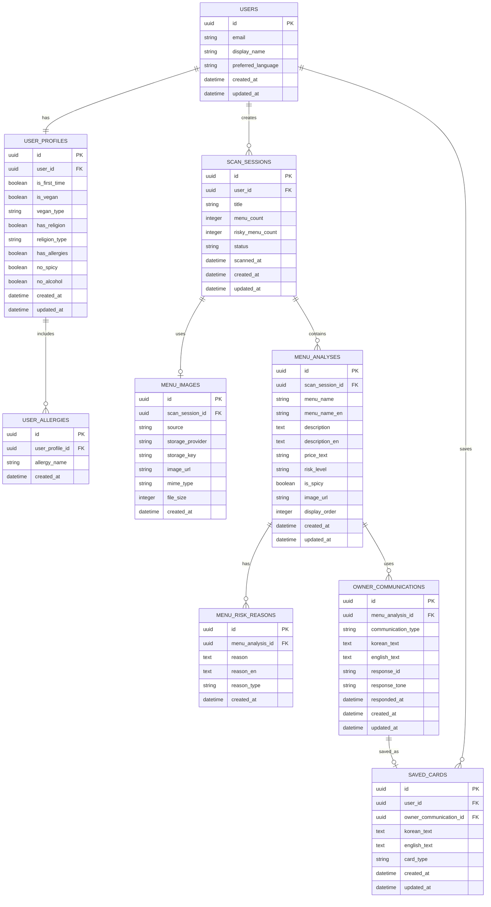

# HanSpoon ERD 설계

## 기준

현재 코드에는 백엔드, ORM, 마이그레이션, 실제 DB 스키마가 없습니다. 따라서 이 ERD는 React 상태와 화면에서 사용하는 타입을 기준으로 정리한 논리 설계입니다.

주요 근거:

- `UserProfile`: 사용자 식단 프로필
- `PendingMenuImage`: 분석 대상 메뉴판 이미지
- `MenuAnalysis`: 분석된 메뉴 결과
- `HistoryItem`: 스캔/분석 이력
- `OwnerCommunicationSheet`: 주문/재료 확인/제외 요청 카드와 사장님 응답
- `MyPageScreen`: 저장한 요청 카드

## ERD



## 테이블 상세

### `users`

앱 사용자 기본 정보입니다. 현재 코드에서는 이메일이 `user@example.com`으로 고정 표시되고 실제 로그인 저장 구조는 없지만, 마이페이지와 프로필 소유 관계를 위해 필요합니다.

| 컬럼 | 타입 | 설명 |
| --- | --- | --- |
| `id` | `uuid` | 사용자 ID |
| `email` | `string` | 이메일 |
| `display_name` | `string` | 표시 이름 |
| `preferred_language` | `string` | `ko`, `en` |
| `created_at` | `datetime` | 생성일 |
| `updated_at` | `datetime` | 수정일 |

### `user_profiles`

온보딩에서 입력하는 식단 프로필입니다.

| 컬럼 | 타입 | 설명 |
| --- | --- | --- |
| `id` | `uuid` | 프로필 ID |
| `user_id` | `uuid` | 사용자 FK |
| `is_first_time` | `boolean` | 한국 음식 처음 여부 |
| `is_vegan` | `boolean` | 채식/비건 여부 |
| `vegan_type` | `string` | 비건, 락토, 오보, 락토오보, 페스코 |
| `has_religion` | `boolean` | 종교 식단 여부 |
| `religion_type` | `string` | 할랄, 코셔, 힌두, 기타 |
| `has_allergies` | `boolean` | 알레르기 여부 |
| `no_spicy` | `boolean` | 매운 음식 비선호 |
| `no_alcohol` | `boolean` | 금주 |
| `created_at` | `datetime` | 생성일 |
| `updated_at` | `datetime` | 수정일 |

### `user_allergies`

사용자 알레르기 목록입니다. 현재 UI 선택지는 갑각류, 견과류, 유제품, 계란, 글루텐, 대두입니다.

| 컬럼 | 타입 | 설명 |
| --- | --- | --- |
| `id` | `uuid` | 알레르기 ID |
| `user_profile_id` | `uuid` | 프로필 FK |
| `allergy_name` | `string` | 알레르기명 |
| `created_at` | `datetime` | 생성일 |

### `scan_sessions`

메뉴판 1회 분석 이력입니다. 현재 `HistoryItem`에 해당합니다.

| 컬럼 | 타입 | 설명 |
| --- | --- | --- |
| `id` | `uuid` | 스캔 세션 ID |
| `user_id` | `uuid` | 사용자 FK |
| `title` | `string` | 이력 제목 |
| `menu_count` | `integer` | 인식된 메뉴 수 |
| `risky_menu_count` | `integer` | `safe`가 아닌 메뉴 수 |
| `status` | `string` | `pending`, `analyzing`, `completed`, `failed` |
| `scanned_at` | `datetime` | 스캔 시각 |
| `created_at` | `datetime` | 생성일 |
| `updated_at` | `datetime` | 수정일 |

### `menu_images`

스캔에 사용된 이미지 정보입니다. 현재 `PendingMenuImage.storage`에 `postgresql`, `blob` 가능성이 표시되어 있어 저장소 정보를 분리했습니다.

| 컬럼 | 타입 | 설명 |
| --- | --- | --- |
| `id` | `uuid` | 이미지 ID |
| `scan_session_id` | `uuid` | 스캔 세션 FK |
| `source` | `string` | `camera`, `upload` |
| `storage_provider` | `string` | `postgresql`, `blob` 등 |
| `storage_key` | `string` | 외부 저장소 키 |
| `image_url` | `string` | 이미지 접근 URL |
| `mime_type` | `string` | `image/jpeg`, `image/png`, `image/webp` |
| `file_size` | `integer` | 파일 크기 |
| `created_at` | `datetime` | 생성일 |

### `menu_analyses`

분석된 개별 메뉴입니다. 현재 `MenuAnalysis`에 해당합니다.

| 컬럼 | 타입 | 설명 |
| --- | --- | --- |
| `id` | `uuid` | 메뉴 분석 ID |
| `scan_session_id` | `uuid` | 스캔 세션 FK |
| `menu_name` | `string` | 한국어 메뉴명 |
| `menu_name_en` | `string` | 영어 메뉴명 |
| `description` | `text` | 한국어 설명 |
| `description_en` | `text` | 영어 설명 |
| `price_text` | `string` | 가격 문자열 |
| `risk_level` | `string` | `safe`, `caution`, `danger` |
| `is_spicy` | `boolean` | 매움 여부 |
| `image_url` | `string` | 메뉴 이미지 URL |
| `display_order` | `integer` | 화면 표시 순서 |
| `created_at` | `datetime` | 생성일 |
| `updated_at` | `datetime` | 수정일 |

### `menu_risk_reasons`

메뉴의 위험/주의 사유입니다. 현재 `riskReasons`, `riskReasonsEn` 배열을 정규화했습니다.

| 컬럼 | 타입 | 설명 |
| --- | --- | --- |
| `id` | `uuid` | 위험 사유 ID |
| `menu_analysis_id` | `uuid` | 메뉴 분석 FK |
| `reason` | `text` | 한국어 사유 |
| `reason_en` | `text` | 영어 사유 |
| `reason_type` | `string` | `allergy`, `religion`, `vegan`, `spicy`, `alcohol`, `ingredient` 등 |
| `created_at` | `datetime` | 생성일 |

### `owner_communications`

메뉴별 사장님 소통 카드와 응답 상태입니다. 현재 화면의 `order`, `ingredient`, `request`, `spicy` 타입과 응답 선택값을 저장합니다.

| 컬럼 | 타입 | 설명 |
| --- | --- | --- |
| `id` | `uuid` | 소통 카드 ID |
| `menu_analysis_id` | `uuid` | 메뉴 분석 FK |
| `communication_type` | `string` | `order`, `ingredient`, `request`, `spicy` |
| `korean_text` | `text` | 한국어 문구 |
| `english_text` | `text` | 영어 문구 |
| `response_id` | `string` | `ok`, `yes`, `no`, `possible`, `difficult` |
| `response_tone` | `string` | `success`, `caution`, `danger` |
| `responded_at` | `datetime` | 응답 선택 시각 |
| `created_at` | `datetime` | 생성일 |
| `updated_at` | `datetime` | 수정일 |

### `saved_cards`

마이페이지의 저장한 요청 카드입니다. 현재는 하드코딩 배열이지만 사용자별 저장 데이터로 분리하는 것이 자연스럽습니다.

| 컬럼 | 타입 | 설명 |
| --- | --- | --- |
| `id` | `uuid` | 저장 카드 ID |
| `user_id` | `uuid` | 사용자 FK |
| `owner_communication_id` | `uuid` | 원본 소통 카드 FK, 직접 작성 카드면 nullable |
| `korean_text` | `text` | 한국어 문구 |
| `english_text` | `text` | 영어 문구 |
| `card_type` | `string` | `order`, `ingredient`, `request`, `spicy`, `custom` |
| `created_at` | `datetime` | 생성일 |
| `updated_at` | `datetime` | 수정일 |

## 관계 요약

| 관계 | 카디널리티 | 설명 |
| --- | --- | --- |
| `users` - `user_profiles` | 1:1 | 사용자당 식단 프로필 1개 |
| `user_profiles` - `user_allergies` | 1:N | 프로필에 여러 알레르기 |
| `users` - `scan_sessions` | 1:N | 사용자별 스캔 이력 |
| `scan_sessions` - `menu_images` | 1:0..1 | 스캔에 사용한 이미지 |
| `scan_sessions` - `menu_analyses` | 1:N | 1회 분석에 여러 메뉴 |
| `menu_analyses` - `menu_risk_reasons` | 1:N | 메뉴별 위험 사유 |
| `menu_analyses` - `owner_communications` | 1:N | 메뉴별 주문/확인/요청 카드 |
| `users` - `saved_cards` | 1:N | 사용자별 저장 카드 |
| `owner_communications` - `saved_cards` | 1:0..1 | 소통 카드를 저장 카드로 저장 가능 |

## enum 후보

DB 제약 또는 애플리케이션 enum으로 관리하면 좋습니다.

```sql
-- language
'ko', 'en'

-- image source
'camera', 'upload'

-- scan status
'pending', 'analyzing', 'completed', 'failed'

-- risk level
'safe', 'caution', 'danger'

-- owner communication type
'order', 'ingredient', 'request', 'spicy'

-- owner response id
'ok', 'yes', 'no', 'possible', 'difficult'

-- owner response tone
'success', 'caution', 'danger'
```

## 인덱스 권장

```sql
CREATE INDEX idx_user_profiles_user_id ON user_profiles(user_id);
CREATE INDEX idx_user_allergies_profile_id ON user_allergies(user_profile_id);
CREATE INDEX idx_scan_sessions_user_scanned_at ON scan_sessions(user_id, scanned_at DESC);
CREATE INDEX idx_menu_analyses_scan_session_id ON menu_analyses(scan_session_id);
CREATE INDEX idx_menu_analyses_risk_level ON menu_analyses(risk_level);
CREATE INDEX idx_menu_risk_reasons_menu_id ON menu_risk_reasons(menu_analysis_id);
CREATE INDEX idx_owner_communications_menu_id ON owner_communications(menu_analysis_id);
CREATE INDEX idx_saved_cards_user_id ON saved_cards(user_id);
```

## 구현 시 참고

현재 프론트엔드 상태의 `HistoryItem.menus`는 분석 이력 안에 메뉴 배열을 그대로 들고 있습니다. DB에서는 `scan_sessions`와 `menu_analyses`로 나누어 저장하는 편이 조회, 필터링, 통계 확장에 유리합니다.

현재 `riskReasons`와 `riskReasonsEn`은 배열 인덱스가 서로 맞아야 하는 구조입니다. DB에서는 `menu_risk_reasons`에 한 행으로 묶어 저장하면 다국어 데이터 불일치 위험을 줄일 수 있습니다.

현재 저장 카드는 `MyPageScreen` 내부 하드코딩 데이터입니다. 실제 기능으로 전환하면 `owner_communications`에서 생성된 문구를 `saved_cards`로 복사 저장하는 구조가 가장 단순합니다.
